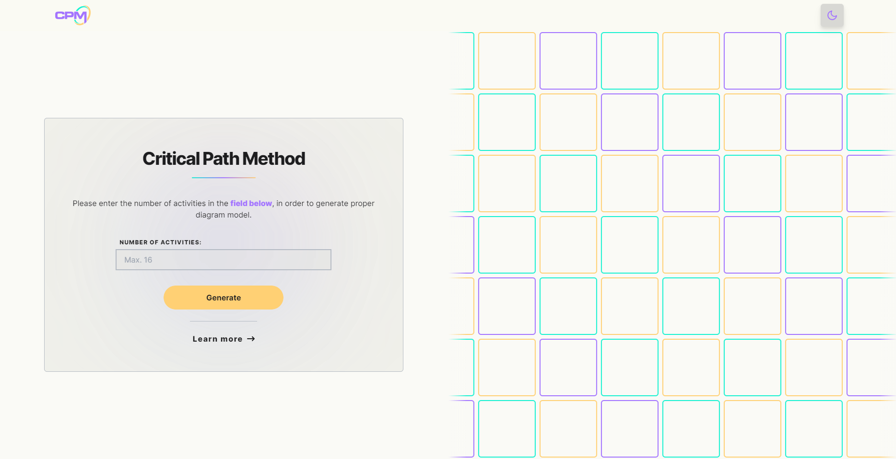
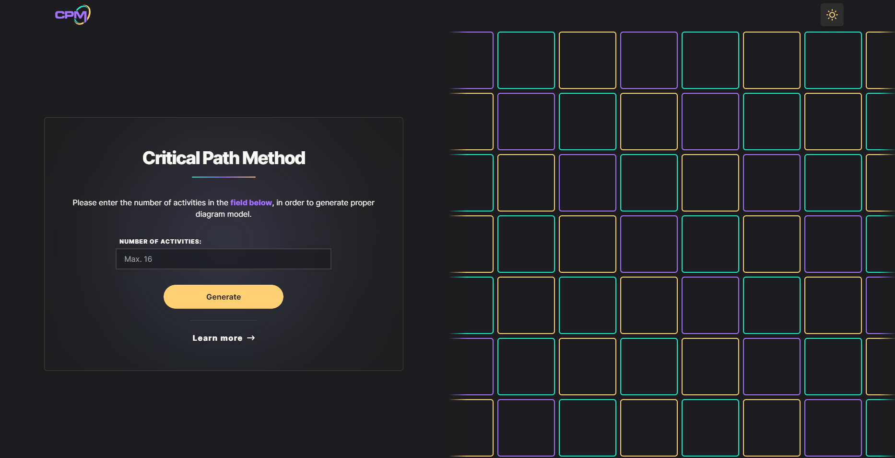

<div align="center">


# CPM Calculator Project

[Live Page][live-page] . [Fallback Page][fallback-page]

</div>

<details>
<summary>Table of contents</summary>

-   [Overview](#overview)
    -   [Description](#the-challenge)
    -   [Landing Page](#landing-page)
    -   [Table Modal](#table-modal)
    -   [Diagram Panel](#diagram-panel)
    -   [Gantt Chart](#gantt-chart)
    -   [404 Page](#404-page)
    -   [Dark Mode](#dark-mode)
    -   [Links](#links)
-   [My process](#my-process)
    -   [Built with](#built-with)
    -   [Getting Started](#getting-started)
-   [Author](#author)

</details>

## Overview

### Description

CPM Calculator Project is a web application project built using Next.js and Tailwindcss for classes at AGH in Kraków. User can choose how many activities the diagram should consist of and, after completing the basic information, they can go to the subpage where the diagram will be displayed along with the calculated data and a Gantt chart.

### Landing Page

The homepage displays an input where user can provide number of activities.

Below is a section explaining what CPM is and its benefits.

<table>
    <tr>
        <td>
            
        </td>
        <td>
            
        </td>
    </tr>
</table>

### Table Modal

After opening modal user can provide sets of data to-be calculated.

<table>
    <tr>
        <td>
            
        </td>
        <td>
            
        </td>
    </tr>
</table>

### Diagram Panel

If the data is completed correctly, the user will be redirected to a subpage where a diagram with the calculated information will be displayed.

<table>
    <tr>
        <td>
            
        </td>
        <td>
            
        </td>
    </tr>
</table>

### Gantt Chart

After clicking the button, a modal will open, inside which the created Gantt chart will be displayed.

<table>
    <tr>
        <td>
            
        </td>
        <td>
            
        </td>
    </tr>
</table>

### 404 Page

If user enter incorrect data, they will be redirected to the 404 Page.

<table>
    <tr>
        <td>
            
        </td>
        <td>
            
        </td>
    </tr>
</table>

### Dark Mode

This is what the Dark Mode version looks like.

<table>
    <tr>
        <td>
            
        </td>
        <td>
            
        </td>
    </tr>
</table>

### Links

-   [Live Page][live-page]
-   [Fallback Page][fallback-page]

## My Process

### Built with

-   Next.js
-   TailwindCSS
-   Framer Motion
-   JavaScript

### Getting Started

First, run the development server:

```bash
npm run dev
# or
yarn dev
# or
pnpm dev
```

Open [http://localhost:3000](http://localhost:3000) with your browser to see the result.

You can start editing the page by modifying `app/page.js`. The page auto-updates as you edit the file.

This project uses [`next/font`](https://nextjs.org/docs/basic-features/font-optimization) to automatically optimize and load Inter, a custom Google Font.

## Author

-   JCzyszczon - [Github](https://github.com/JCzyszczon)
-   JCzyszczon - [Linkedin](https://www.linkedin.com/in/jakub-czyszczoń-5265b02a6/)

<p align="right">(<a href="#top">back to top</a>)</p>

[live-page]: https://cpm-calculator-omega.vercel.app
[fallback-page]: https://cpm-calculator-jczyszczons-projects.vercel.app